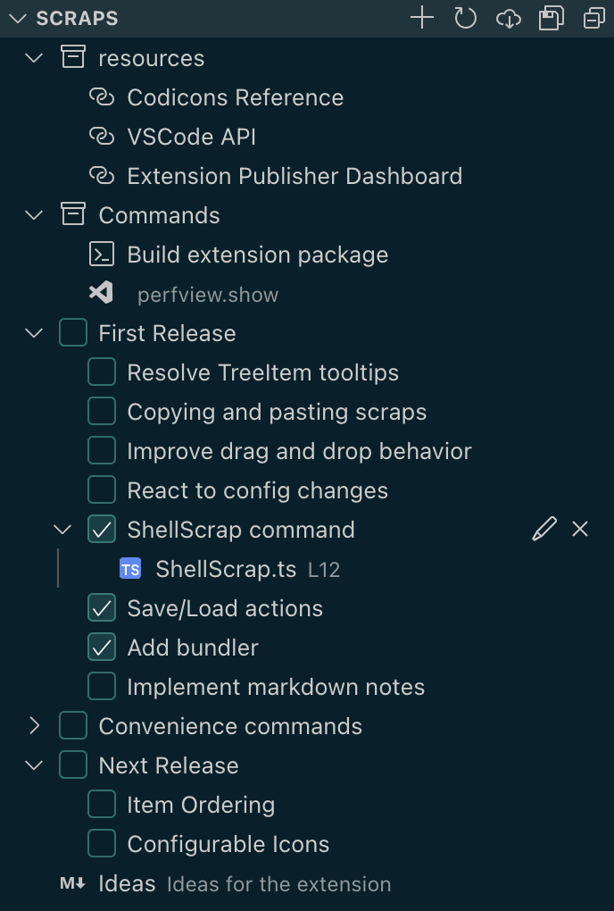

# VSCode Scraps

This extension adds a panel with different kind of items such as

- shortcuts to files
- website links
- terminal commands
- vscode commands
- todo items
- markdown notes

## Features

There are different kinds of scraps which can perform different actions.

## Extension Settings

This extension contributes the following settings:

- `doublefloat.scraps.path`: Path to the scrapbook data file
- `doublefloat.scraps.saveOnChange`: Save scrapbook state automatically

<!-- > ## Known Issues
>
> Calling out known issues can help limit users opening duplicate issues against
> your extension. -->

## Release Notes

See [changelog](CHANGELOG.md)
